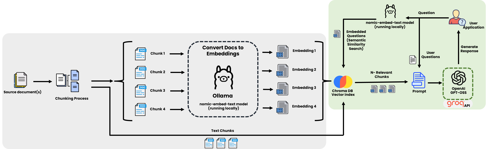

# RAG (Retrieval-Augmented Generation) Demo

A demonstration of Retrieval-Augmented Generation (RAG) technique to improve LLM responses. Uses [Pakistan's National AI Policy](https://moitt.gov.pk/SiteImage/Misc/files/National%20AI%20Policy%20Consultation%20Draft%20V1.pdf) as an example source document. This project showcases how RAG can be used to create intelligent chatbots that can answer questions based on specific documents with accurate, contextual responses.

## Purpose

This repository demonstrates the implementation of a RAG system that:
- Processes and indexes PDF documents using vector embeddings
- Provides an interactive chat interface for querying document content
- Generates accurate, context-aware responses using retrieved information
- Maintains conversation history and context across multiple chat sessions

## Features

- **Document Processing**: Automatic PDF loading and chunking with configurable parameters
- **Vector Database**: ChromaDB integration for efficient document retrieval
- **Embedding Model**: Uses Ollama with nomic-embed-text for generating embeddings
- **LLM Integration**: Groq API integration for generating responses
- **Interactive UI**: Streamlit-based chat interface with modern design
- **Chat Management**: Multiple conversation sessions with automatic title generation
- **Context Awareness**: Maintains conversation history for better response quality
- **Citation Support**: Automatic citation of source sections in responses
 - **RAG Evaluation**: Giskard-based evaluation notebook, sample test set, and HTML report

## Architecture


## Prerequisites

- Python 3.11.*
- [Ollama](https://ollama.ai/)
    - Installed and running locally
    - [`nomic-embed-text`](https://ollama.com/library/nomic-embed-text) available locally
- [Groq API key](https://console.groq.com/keys)


## Setup Instructions
1. Clone & setup:
    ```
    git clone https://github.com/byahmedali/RAG.git

    cd RAG

    uv sync
    ```

2. Create a `.env` file with your GROQ API key:
    ```
    GROQ_API_KEY="your_groq_api_key"
    ```

3. **Start Ollama and pull the embedding model** (if not already available)
   ```
   ollama pull nomic-embed-text
   ```

4. **Run the application**
   ```
   streamlit run app.py
   ```

The application should be available at `http://localhost:8501`

## Project Structure

```
RAG/
├── app.py                      # Main Streamlit application
├── data/                       # Source documents (PDF files)
├── chroma_db/                  # Vector database storage
├── static/                     # Static assets (images)
├── extras/
│   ├── generate_embeddings.py  # Document processing utilities
│   ├── chat_title.py          # Chat title generation
│   ├── debug.py               # Debugging utilities
│   └── examples.ipynb         # Jupyter notebook examples
├── evaluation.ipynb           # Giskard RAG evaluation notebook
├── testset10.jsonl            # Sample evaluation test cases (generated)
├── report.html                # Example evaluation report (generated)
├── pyproject.toml             # Project dependencies
└── README.md                  # This file
```

## Configuration

### Document Processing
- **Chunk Size**: 1000 characters (configurable in `extras/generate_embeddings.py`)
- **Chunk Overlap**: 200 characters
- **Embedding Model**: nomic-embed-text (via Ollama)

### Retrieval Settings
- **Top-k Results**: 5 most relevant chunks per query
- **Similarity Search**: Cosine similarity in ChromaDB

### LLM Settings
- **Model**: OpenAI GPT-OSS-120B (via Groq)
- **Temperature**: 0 (deterministic responses)
- **Streaming**: Enabled for real-time response generation

## RAG Evaluation (Giskard)

This repository includes assets to evaluate the RAG system using [Giskard's RAG Evaluation Toolkit](https://docs.giskard.ai/en/latest/open_source/testset_generation/index.html).

### What's included
- `evaluation.ipynb`: End-to-end notebook that runs the evaluation.
- `testset10.jsonl`: A sample test set with 10 questions/answers for quick validation.
- `report.html`: Example HTML evaluation report generated by the notebook.

## Contributing

Contributions are welcome! Please feel free to submit a Pull Request.
> **Note**: This is a demonstration project.
